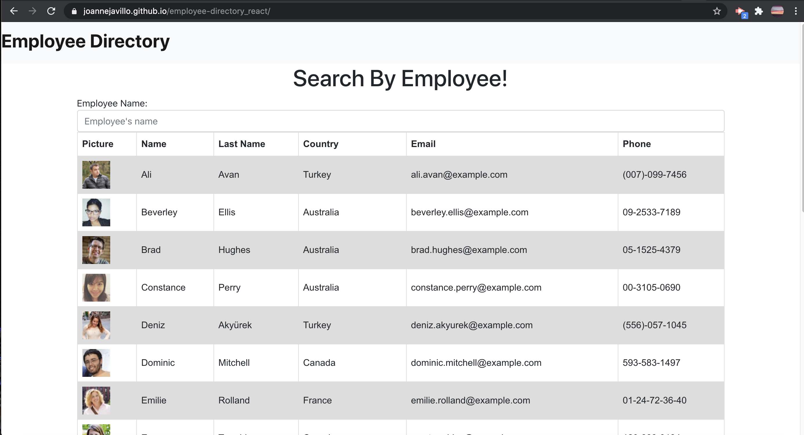
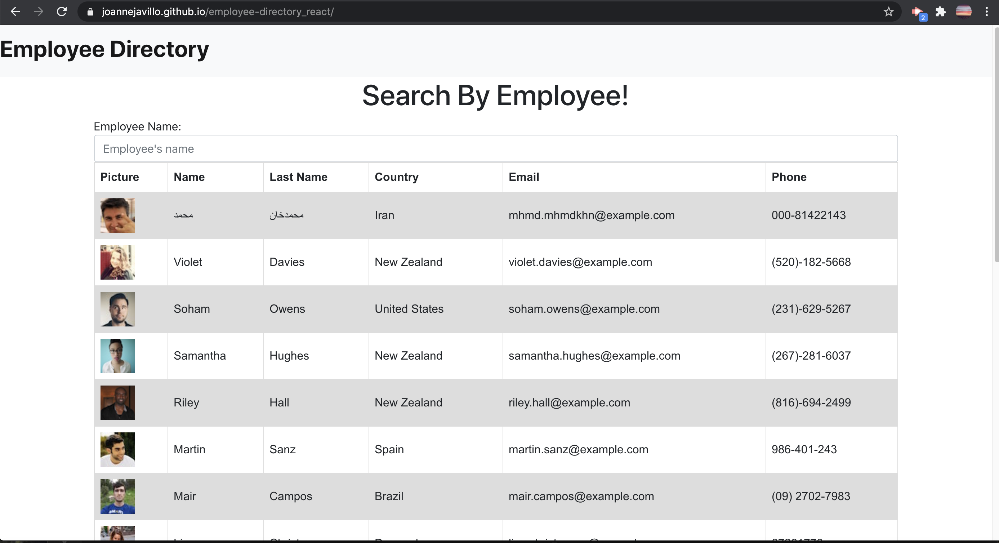
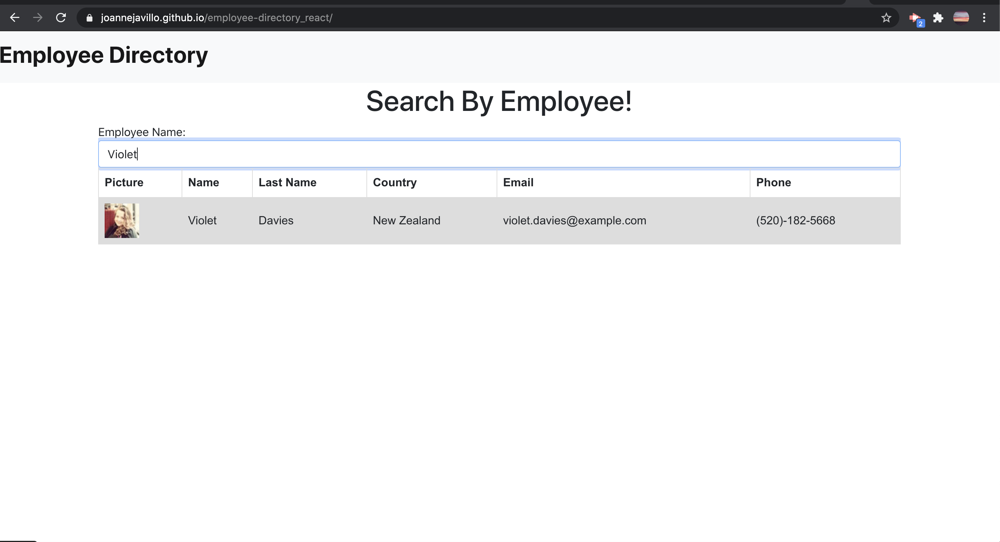
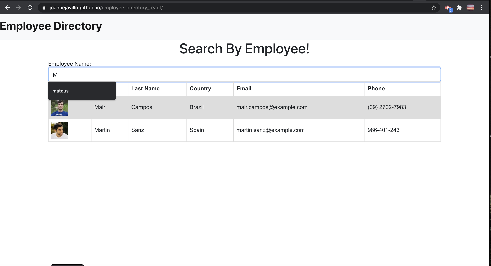
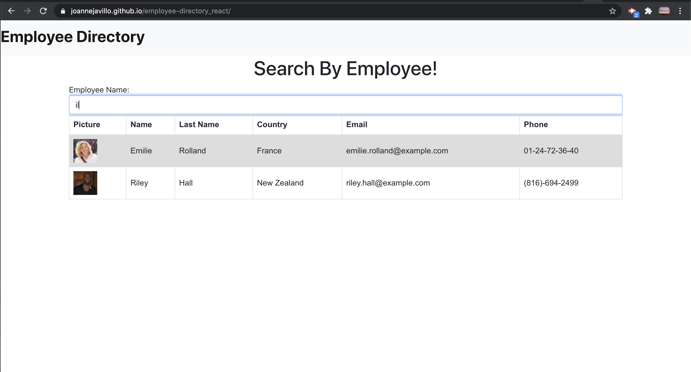

## employee-directory_react

## Description 
- This react application is all about creating an Employee directory using React application.
- The user will be able to sort the table based on the name (First Name) of the employee. 
  > If the user click the (First)Name header, it can sort the name of the employee either in ascending or descending order.
 - The user will be able to filter the name of the employee
   > If the user will type the first letter (Upper case) it will filter the employee's name by the first letter.
   > If the user will type in lower case letters, it will give the user the names of employee's that has that letter.
---
---

# Table of Contents 

  - [Description](#Description)
  - [Technologies](#Technologies)
  - [Links](#Links)
  - [Screenshots](#Screenshots)
  - [Challenges](#Challenges)
  - [License](#License)
  - [Questions](#questions)
---

## Technologies
NPM, React, Github

---
## Links
 - Github: (https://github.com/joannejavillo/employee-directory_react)
 - Deployed link : (https://joannejavillo.github.io/employee-directory_react/)
 

---
## Screenshots
 "Main page- Filter: Ascending Order"
---

 "Filter: Descending Order"
---

 "Sort by name" 
---

 "Filter by name - first letter" 
---

 "Filter by name - lower case" 
---

---

## Challenges
 - Deploying in Github is quite challenging
---
## License
- MIT
---
## Questions
If you have any questions you can contact me at jo_anne.javillo@outlook.com or you can visit my gitHub page: (https://github.com/joannejavillo)

---
---
---

# Getting Started with Create React App

This project was bootstrapped with [Create React App](https://github.com/facebook/create-react-app).

## Available Scripts

In the project directory, you can run:

### `npm start`

Runs the app in the development mode.\
Open [http://localhost:3000](http://localhost:3000) to view it in the browser.

The page will reload if you make edits.\
You will also see any lint errors in the console.

### `npm test`

Launches the test runner in the interactive watch mode.\
See the section about [running tests](https://facebook.github.io/create-react-app/docs/running-tests) for more information.

### `npm run build`

Builds the app for production to the `build` folder.\
It correctly bundles React in production mode and optimizes the build for the best performance.

The build is minified and the filenames include the hashes.\
Your app is ready to be deployed!

See the section about [deployment](https://facebook.github.io/create-react-app/docs/deployment) for more information.

### `npm run eject`

**Note: this is a one-way operation. Once you `eject`, you can’t go back!**

If you aren’t satisfied with the build tool and configuration choices, you can `eject` at any time. This command will remove the single build dependency from your project.

Instead, it will copy all the configuration files and the transitive dependencies (webpack, Babel, ESLint, etc) right into your project so you have full control over them. All of the commands except `eject` will still work, but they will point to the copied scripts so you can tweak them. At this point you’re on your own.

You don’t have to ever use `eject`. The curated feature set is suitable for small and middle deployments, and you shouldn’t feel obligated to use this feature. However we understand that this tool wouldn’t be useful if you couldn’t customize it when you are ready for it.

## Learn More

You can learn more in the [Create React App documentation](https://facebook.github.io/create-react-app/docs/getting-started).

To learn React, check out the [React documentation](https://reactjs.org/).

### Code Splitting

This section has moved here: [https://facebook.github.io/create-react-app/docs/code-splitting](https://facebook.github.io/create-react-app/docs/code-splitting)

### Analyzing the Bundle Size

This section has moved here: [https://facebook.github.io/create-react-app/docs/analyzing-the-bundle-size](https://facebook.github.io/create-react-app/docs/analyzing-the-bundle-size)

### Making a Progressive Web App

This section has moved here: [https://facebook.github.io/create-react-app/docs/making-a-progressive-web-app](https://facebook.github.io/create-react-app/docs/making-a-progressive-web-app)

### Advanced Configuration

This section has moved here: [https://facebook.github.io/create-react-app/docs/advanced-configuration](https://facebook.github.io/create-react-app/docs/advanced-configuration)

### Deployment

This section has moved here: [https://facebook.github.io/create-react-app/docs/deployment](https://facebook.github.io/create-react-app/docs/deployment)

### `npm run build` fails to minify

This section has moved here: [https://facebook.github.io/create-react-app/docs/troubleshooting#npm-run-build-fails-to-minify](https://facebook.github.io/create-react-app/docs/troubleshooting#npm-run-build-fails-to-minify)
